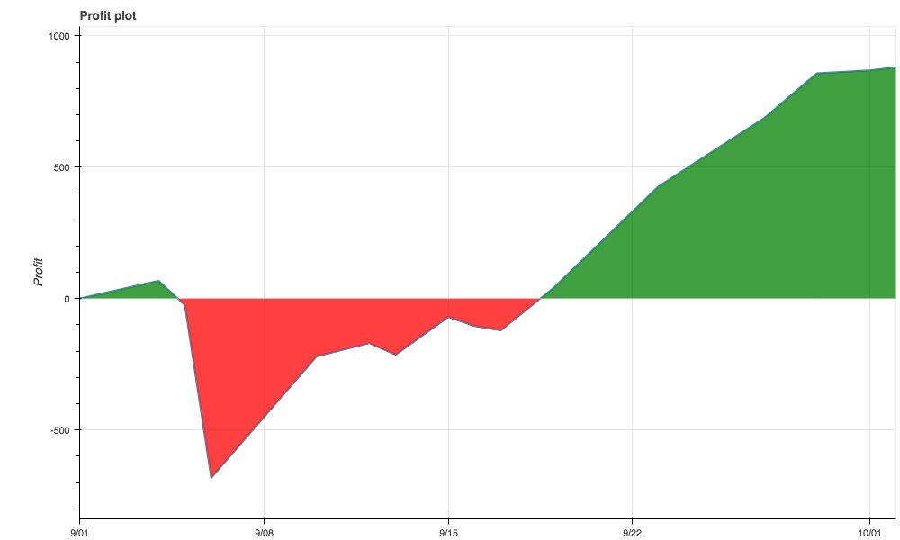

# Tradingene: A Package For Backtesting Trading Algorithms


The Tradingene package turns your computer into a tool for developing and backtesting trading strategies you write in the Python programming language. Having been developed and backtested, these ones can be then easily adapted for live trading at the [Tradingene Platform](https://tradingene.com).

## Installation
Tradingne can be installed via pip for python3:

    pip3 install tradingene

## Getting Started

An algorithm performs a trading logic that is implemented in a user defined function. If we want to test profitability of this logic we have to perform a backtest which consists of a series of consecutive calls of this (user defined) function.

---
Suppose we came up with the following trading logic:

  - open a long position if the closing price of a bar is greater than the open price;
  - open a short position if the closing price of a bar is less than the open price;
  - do not make any changes to the position otherwise.

To start coding we need to define the _name_ and the _regime_ of the algorithm as well as the *start_date* and the *end_date* of the backtesting period:

### Setting parameters

```python
from datetime import datetime
from tradingene.algorithm_backtest.tng import TNG
from tradingene.backtest_statistics import backtest_statistics as bs
name = "Cornucopia"
regime = "SP"
start_date = datetime(2018, 9, 1)
end_date = datetime(2018, 10, 1)
```

After that we are ready to create an instance of the ```TNG``` class. The instance named ```alg``` will contain all the methods required for backtesting.

```python
alg = TNG(name, regime, start_date, end_date)
```
[_See  more on initialization_](tradingene/docs/user_guide/misc/initialization.md).

 Next we are able to specify an instrument and timeframe (measured in minutes) that we will use in our backtest:

```python
alg.addInstrument("btcusd")
alg.addTimeframe("btcusd", 1440)
```
[_See  more on adding instruments and timeframes_](tradingene/docs/user_guide/misc/import_instruments.md).

### Implementing trading logic

In the next step we will code the ```onBar()``` function that will implement our trading logic:

```python
def onBar(instrument):
  if instrument.open[1] > instrument.close[1]:
    # If the price moved down we take a short position
    alg.sell()
  elif instrument.open[1] < instrument.close[1]:
    # If the price moved up we take a long position
    alg.buy()
  else:
    # If the price did not change then do nothing
    pass
```

The ```instrument``` variable contains price values as well as the values of specified technical indicators.

[_See more on onBar function_](tradingene/docs/user_guide/misc/onbar.md).

Now we are ready to run a backtest:
```python
alg.run_backtest(onBar)
```

### Results of backtest

After the backtest is complete we may retrieve the statistics to estimate the performance of our algorithm:

```python
stats = bs.BacktestStatistics(alg)
stats.backtest_results(plot=True, filename="backtest_stats")
```

With these lines of code we make the backtest statistics formatted into an html page named ```backtest_stats.html```. This page also shows us a cumulative profit plot, just like the one presented below:



[_See more on backtest statistics_](tradingene/docs/user_guide/backtest_statistics/backtest_results.md).

## Machine learning and loading data

A powerful feature of the ```Tradingene``` package is the ability to load, recalculate and convert data into a form suitable to train machine learning models with. That's why an algotrader can easily create and backtest "learning" trading robots.

With a series of our mini-lessons you'll learn how to use neural networks for solving [classification]() and [regression]() problems (with respect to the challenges of trading) as well as how to engage an [SVM]() etc.

 See more on [loading data](tradingene/docs/user_quide/misc/loading_data.md).
